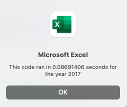
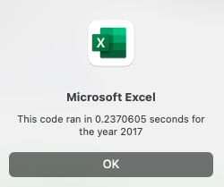
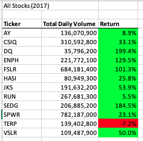
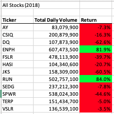

# Stock_Analysis

# Overview

The initial analysis was to review the performance of New Energy Corporation (DAQO), a company that makes silicon wafers for solar panels, among other green energy stocks using data from 2017-2018. In total there were a dozen green energy stocks stored within an excel workbook.

Several tasks were automated in order to perform calculations for the analysis using VBA scripting including:
* Iterating through each of the 12 tickers, using arrays and nested for loops to calculate the total daily volume and the return for each.
* Using static formatting methods to bold the headers, add a border, automatically adjust column widths and update the numeric columns.
* Using conditional formatting methods to highlight cells in red and green based on the value of return output as integers.
* Adding buttons and input boxes to run easily run the macros for each year seperately.

The last task was to refactor the code so that it could be used for the entire stock market, which is ultimately a lot more than a dozen stocks. The challenge was to reduce the need to repeate extensive code so that it runs faster given more data. This was accomplished by creating additional arrays for tickers, volumes, starting and end prices and for loops to read and store the information for each row.

# Results

The first image on the left represents the code execution time after refactoring the code. There is a significant difference 

 

The results were the same for 2018 after refactoring the code.

 

Below is the output from both years as tables:

 

# Summary

As seen in the results, refactoring code can significantly speed up a computers processing time. It also reduces the chances of error in writing out repetitive processes which could then be difficult to debug. A disadvantage could be ruining an entire script in an effort to make it better, so it's important to use resources such as the Excel documentation or StackOverflow to find meaninful, clean code. In this case, we were able to repeat and modify code, to make it cleaner usin the same patterns and formats.

